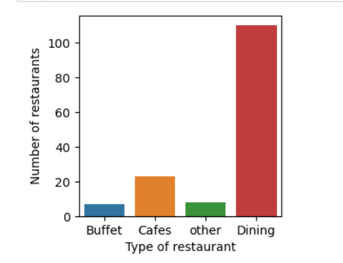
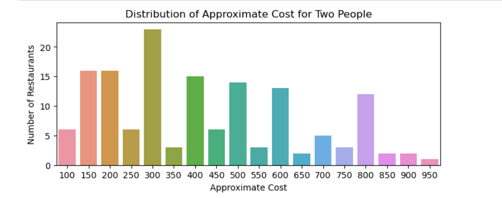
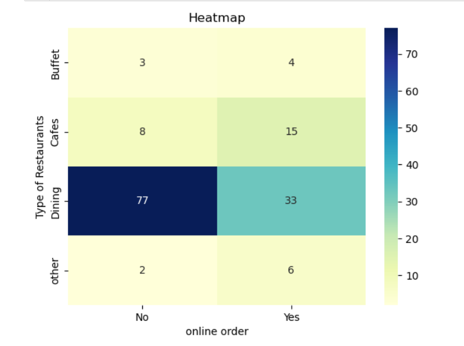
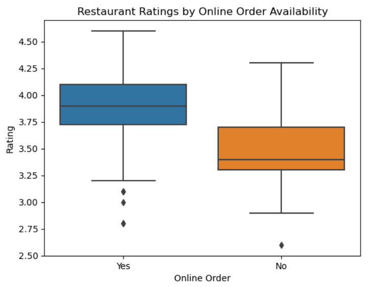

#  Zomato Restaurant Data Analysis using Python

## Project Overview

This project performs **Exploratory Data Analysis (EDA)** on the Zomato restaurant dataset using Python. The objective is to analyze restaurant characteristics, customer ratings, pricing, online ordering, table booking, and customer engagement to uncover meaningful patterns and generate business insights.

The project demonstrates the complete EDA workflow, including data cleaning, data exploration, visualization, and interpretation of results.

---

##  Objectives

- Understand the structure of the dataset.
- Clean and preprocess the data.
- Explore restaurant ratings and customer votes.
- Analyze restaurant pricing patterns.
- Study the impact of online ordering and table booking.
- Generate business insights from the analysis.

---

##  Dataset

The dataset contains information about restaurants, including:

- Restaurant Name
- Restaurant Type
- Customer Ratings
- Customer Votes
- Approximate Cost for Two People
- Online Order Availability
- Table Booking Availability

---

## Technologies Used

- Python
- Pandas
- NumPy
- Matplotlib
- Seaborn
- Jupyter Notebook

---

## Exploratory Data Analysis

The following analyses were performed:

- Initial Data Inspection
- Data Cleaning
- Restaurant Type Distribution
- Customer Votes Analysis
- Restaurant with Highest Votes
- Online Order Analysis
- Rating Distribution
- Price Distribution
- Online Order vs Ratings
- Restaurant Type vs Online Order
- Table Booking Distribution
- Table Booking vs Ratings (Bar Chart)
- Table Booking vs Ratings (Box Plot)

---

## Sample Visualizations

### Restaurant Type Distribution

### Distribution of Approximate Cost for 2 people

### Restautant Types by Online Orders

### Restaurant ratings by Online Order Availability

##  Key Findings

- Dining restaurants are the most common restaurant type.
- Dining restaurants received the highest number of customer votes.
- Restaurants offering online ordering generally have higher average ratings.
- Most restaurants fall within the ₹100–₹550 price range for two people.
- Only a small percentage of restaurants provide table booking facilities.
- Restaurants offering table booking generally have higher and more consistent customer ratings.

---

##  Business Recommendations

- Restaurants may consider improving online ordering services to enhance customer convenience.
- Restaurant owners should analyze customer demand before investing in table booking facilities.
- New restaurants targeting the mid-range price segment may align well with current market trends.

---

##  Skills Demonstrated

- Data Cleaning
- Exploratory Data Analysis (EDA)
- Data Visualization
- Business Insight Generation
- Python Programming
- Pandas
- NumPy
- Matplotlib
- Seaborn

---

## Future Improvements

- Perform Feature Engineering
- Build Machine Learning models
- Create Interactive Dashboards using Power BI or Tableau
- Deploy the analysis as a web application

---
## References

The following resources were used for learning concepts and Python syntax during the development of this project:

- GeeksforGeeks – Python and Pandas tutorials
- Pandas Official Documentation
- Matplotlib Official Documentation
- Seaborn Official Documentation

## 👩‍💻 Author

**Larine Theresa Pereira**

Aspiring Data Scientist | Python | Data Analytics | Machine Learning Enthusiast

